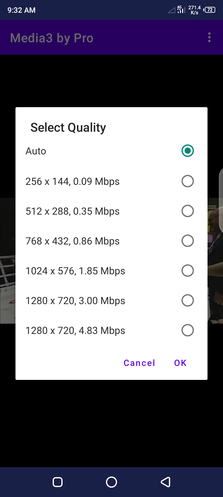
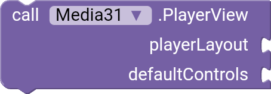
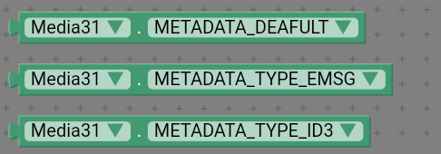
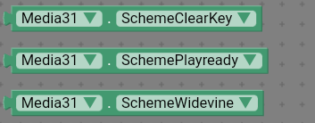

## Media Player Extension based on Androidx Media3 Library for AppInventor, Kodular and Niotron, Media3 is upgraded version of Exoplayer

Hello dear! it's **Media Player Extension based on Androidx Media3 Library** in this extension i used Androidx Media3 library **version 1.3.1** it's latest version of Media3. Why i not used **Exoplayer library** to create this extension because Exoplayer is deprecated and google will not continue exoplayer because **Google launched Media3, Media3 contains all exciting Exoplayer features and even more** basically **Media3** is upgraded version of **Exoplayer**.
Our extension support all Media protocols like MP4, HLS, DASH, RTSP and SmoothStreaming. This Extension will be best choice for **Developers** who demand the best performance and flexibility in media.

## Feature's

✔️ **Support all DRM protected media's.**   

✔️ **Most highlighted feature is developer can create custom controls, Any type he/she want..**   

✔️ **Default Controls.**


✔️ **Custom Controls**   


✔️ **Quality selection, user can change quality.** 




# Supported formats

✔️ Streaming: HLS, DASH, RTSP and SmoothStreaming  
✔️ Containers: MP4, MOV, FLV, MKV, WebM, Ogg, MPEG  
✔️ Video: H.263, H.264 AVC, H.265 HEVC, MPEG-4 SP, VP8, VP9, AV1  
✔️ Audio: Vorbis, Opus, FLAC, ALAC, MP1, MP2, MP3, AAC, AC-3, E-AC-3, DTS, DTS-HD, TrueHD

# DRM

✔️ Widevine  
✔️ Clearkey  
✔️ Playready

# Events

### OnAudioSessionIdChanged


**Event raised when audio session change.**

audioSessionId = **Number**

### OnControlsVisibilityChanged


**Event raised when controls visible or hide.**

visible = **Boolean**

### OnCues


**Event raised when **Text** output changes.**

cues = **List**

### OnFullscreenButtonClick


**Event raised when fullscreen button clicked.**

isFullscreen = **Boolean**

### OnIsLoadingChanged


**Event raised when the player starts or stops loading.**

isLoading = **Boolean**

### OnIsPlayingChanged


**Event raised when the player's play/pause state changes.**

isPlaying = **Boolean**

### OnMaxSeekToPreviousPositionChanged


**Event raised when maximum seek to previous position change.**

maxSeekToPreviousPositionMs = **Number**

### OnMetadataChanged


**Event raised when media metadata changes.**

data = **Dictionary**

**Keys**

```
title,      
artist,     
albumTitle,    
albumArtist,     
displayTitle,   
subtitle,     
description,      
mediaType,     
artwork_uri,      
track_number,      
total_tracks,   
releaseYear,      
playable
```

### OnPlayWhenReadyChanged


**Event raised when play when ready change.**

playWhenReady = **Boolean**   
reason = **Number**

### OnPlaybackStateChanged


**Event raised when playback state has been changed.**

state = **Number**

### OnPlayerError


**Event raised when player got error.**

error = **Text**

### OnPositionDiscontinuity


**Event raised when position discontinuity.**

oldContentPositionMs = **Number**   
oldPositionMs = **Number**   
newContentPositionMs = **Number**   
newPositionMs = **Number**   

### OnProgressUpdate


**Event raised when progress update.**

positionMs = **Number**   
bufferedPositionMs = **Number**   
durationMs = **Number**   

### OnRenderedFirstFrame


**Event raised when video first frame rendered.**

### OnRepeatModeChanged


**Event raised when repeat mode change.**

repeatMode = **Text**

### OnSeekBackIncrementChanged


**Event raised when seek back imcrement change.**

seekBackIncrementMs = **Number** 

### OnSeekForwardIncrementChanged


**Event raised when seek forward imcrement change.**

seekForwardIncrementMs = **Number** 

### OnShuffleModeEnabledChanged


**Event raised when shuffle mode enabled change.**

shuffleModeEnabled = **Boolean** 

### OnTracksChanged


**Event raised when tracks changes.**

videoTracks = **List of Dictionary**   
audioTracks = **List of Dictionary**   
textTracks = **List of Dictionary**   

**Keys**

```
id,      
bitrate,     
accessibilityChannel,    
averageBitrate,     
channelCount,   
codecs,     
containerMimeType,      
cryptoType,     
frameRate,      
roleFlags,      
maxInputSize,   
width,      
height,     
language,       
label
```

### OnVolumeChanged


**Event raised when device volume change.**

volume = **Number**  
muted = **Boolean**  


# Functions

### CustomControls
**Add Custom controls layout in player view.**


**Required**    
controlsLayout = **Arrangement**    

### PlayerView
**Create a player view for player.**



**Required**    
playerLayout = **Arrangement**    
defaultControls = **Boolean** Set False if you set CustomControls

### MovePlayerView
**Move player view in another layout.**


**Required**    
newLayout = **Arrangement**    


### SetBufferingProgress
**Set Buffering Progress Layout.**


**Required**    
progressLayout = **Arrangement**    

**BufferingProgress**


### CreateTimeBar


**Required**    
layout = **Arrangement**    

**TimeBar**


### HideControls
**Hide the play view controls**


### ShowControls
**Show the play view controls**


### SetVolume
**Volume must be between device minimum volume to device maximum volume.**


**Required number**

### SetBrightness
**Brightness must be 0.1 to 1**


**Required number**


### Subbtitles sample


## MediaItems

### DefaultMediaItem
**Create MediaItem for player.**


*Required**    
url = **Text**  
subtitles = **List**   

**Return MediaItem**

### MediaItem
**Create MediaItem for player with custom perameters.**


**Required**    
url = **Text**  
subtitles = **List**   
mimeType = **Text**   
mediaId = **Text**    
startPositionMs = **Number**  
endPositionMs = **Number**   
sartsAtKeyFrame = **Boolean**   
relativeToLiveWindow = **Boolean**   
relativeToDefaultPosition = **Boolean**   

**Default Values**


**Return MediaItem**

### AddMediaItem
**Add MediaItem in MediaItemList.**


**Required**    
index = **Number**  
**Set index 0 if want to add MediaItem at last in MediaItemList**  

mediaItem = **MediaItem**  

### SetMediaItemList


**Required List of MediaItems**

### GetMediaItemList
**Get MediaItem List you seted using SetMediaItemList/AddMediaItem.**


### RemoveMediaItems
**Remove MediaItems from MediaItemList.**


**Required**   
fromIndex = **Number**  
toIndex = **Number**   

### ClearMediaItemList
**Clear MediaItem List as you seted using SetMediaItemList/AddMediaItem.**


**MimeTypes**    


**Use DefaultMimeType if you didn't know MimeType.**


## MediaSoures

### HlsMediaSource
**Create HlsMediaSource for HLS playback.**


**Required**     
httpDataSource = **HttpDataSource**   
mediaItem = **MediaItem**   
allowChunklessPreparation = **Boolean**   
useSessionKeys = **Boolean**   
metadataType = **Number**  
timestampAdjusterInitializationTimeoutMs = **Number**   

**MetadataTypes**



**Default Values**


**Return MediaSource**

### RtspMediaSource


**Required**   
mediaItem = **MediaItem**  
userAgent = **Text**   
timeoutMs = **Number**   
debugLoggingEnabled = **Boolean**   
forceUseRtpTcp = **Boolean**   

**Default Values**


**Return MediaSource**

### SsMediaSource
**Create SsMediaSource for smooth streaming.**


**Required**    
httpDataSource = **HttpDataSource**   
mediaItem = **MediaItem**   
livePresentationDelayMs = **Number**   

**Default Value**


**Return MediaSource**

### DashMediaSource
**Create DashMediaSource for Dynamic Adaptive Streaming over HTTP (DASH) content.**


**Required**   
drmMedia = **DrmMedia**   
httpDataSource = **HttpDataSource**   
mediaItem = **MediaItem**   
fallbackTargetLiveOffsetMs = **Number**   
minLiveStartPositionUs = **Number**   

**Default Values**


**Return MediaSource**

### AddMediaSource
**Add AddMediaSource in MediaSourceList.**


**Required**    
index = **Number**  
**Set index 0 if want to add MediaSource at last in MediaSourceList**  

mediaSource = **MediaSource**  

### SetMediaSourceList


**Required List of MediaSources**

### GetMediaSourceList
**Get MediaSource List you seted using SetMediaSourceList/AddMediaSource.**


### RemoveMediaSources
**Remove MediaSources from MediaSourceList.**


**Required**    
fromIndex = **Number**  
toIndex = **Number**   

### ClearMediaSourceList
**Clear MediaSource List as you seted using SetMediaSourceList/AddMediaSource.**


## DrmMedia's

### DrmMedia 
**Create Drm Media for drm encrypted media. this fetch license keys from license url.**


**Required**   
drmScheme = **Text**   
licenseUrl = **Text**   
multiSession = **Boolean**   
forceDefaultLicenseUri = **Boolean**   
forceSessionsForAudioAndVideoTracks = **Boolean**   
playClearContentWithoutKey = **Boolean**   

**Return DrmMedia**

### LocalDrmMedia
**Create Drm Media with key id and key.**


**Required**   
drmScheme = **Text**   
keyId = **Text**   
key = **Text**   
inHex = **Boolean**   
multiSession = **Boolean**   
forceDefaultLicenseUri = **Boolean**   
forceSessionsForAudioAndVideoTracks = **Boolean**   
playClearContentWithoutKey = **Boolean**   

**Return DrmMedia**

**Default Values**


**Drm Scheme's**



### NoDrmMedia
**Use this if media doesn't required license.**


### HttpDataSource


**Required**    
allowCrossProtocolRedirects = **Boolean**   
connectTimeoutMs = **Number**   
keepPostFor302Redirects = **Boolean**   
readTimeoutMs = **Number**   
requestHeaders = **Dictionary**   
userAgent = **Text**   

**Default Values**


**Return HttpDataSource**

### Request Headers sample


### SetHttpDataSource
**Use this only when you use just MediaItems not any MediaSources else this not work. If you're using MediaSources then you can set HttpDataSource directly in MediaSources..**


**Required**    
httpDataSource = **HttpDataSource**    


### ShowSpeedSelectionDialog


**Required**    
title = **Text**    

### ShowTrackSelectionDialog


**Required**    
title = **Text**    
trackType = **Number**    
showDisableOption = **Boolean**    
allowAdaptiveSelections = **Boolean**    
allowMultipleOverrides = **Boolean**    

### GetTracks
**Get Tracks of current playback content.**


**Required**    
trackType = **Number**    

**Return List of Dictionary**

### SelectTrack
**Select track from current tracks.**


**Required**    
trackType = **Number**    
index = **Number**    
**Set index 0 for Auto.**  

### TrackTypes


### SeekToPrevious


### SeekToNext


### SeekTo
**Seek to a specific position, set position in milliseconds.**


**Required**    
positionMs = **Number**    

### Rewind
**Set rewind milliseconds in properties mean how much they should rewind.**


### FastForward
**Set FastForward milliseconds in properties mean how much they should forward.**


### Prepare
**Call this before calling Play.**


### Play
**Call this after calling Prepare.**


### Pause
**Pause current player.**


### Resume
**Resume current player.**


### Stop 
**Stop current player.**


### Release 
**Release current player.**


### Destroy 
**Destroy current player, Note this reset all functions and properties before you called.**


### Format
**Format milliseconds to in time.**


**Required**    
ms = **Number**   


# Properties

### AutoHideControls
**Set controls will auto hide after timeout.**


**Required Boolean**

### AutoShowControls
**Set controls will auto show.**


**Required Boolean**

### BufferingColor
**Set center progress color.**


**Required Color**

### BufferedPercentage
**Return current BufferedPercentage in Number.**


### BufferedPosition
**Return current BufferedPosition in Number.**


### ControlsTimeout
**Set ControlsTimeout in milliseconds.**


**Required Number**

### CurrentBrightness
**Return current CurrentBrightness in Number.**


### CurrentMediaItemIndex
**Return current MediaItem/MediaSource index in Number.**


### CurrentPosition
**Return current playback position in Milliseconds (Number).**


### CurrentVolume
**Return current device volume in Number.**


### Customize TimeBar
**Required Color**


### FastForwardMs
**Set FastForward in milliseconds, How should forward after calling FastForward function.**


**Required Number**

### HasNext
**This return true if next MediaItem/MediaSource available, Return type Boolean.**


### HasPrevious
**This return true if previous MediaItem/MediaSource available, Return type Boolean.**


**Required Number**

### HideControlsOnTouch
**Set controls should hide on touch.**


**Required Boolean**

### IsControlsFullVisible
**This return true if controls visible, Return type Boolean.**


### IsSeekBackAvailable
**This return true if seek back/rewind available, Return type Boolean.**


### IsSeekForwardAvailable
**This return true if seek forward available, Return type Boolean.**


### KeepScreenOn
**Keep device screen always on.**


**Required Boolean**

### MaxVolume
**This return device maximum volume, Return type Number.**


### MinVolume
**This return device minimum volume, Return type Number.**


### PauseAtAndOfMediaItems
**Pause playback after each MediaItem/MediaSource.**


**Required Boolean**

### PlaybackSpeed
**Set playback speed, Which speed player should play.**


**Required Number**

### PlayWhenReady
**Set play when playback is ready.**


**Required Boolean**

### RepeatMode
**Set Repeat Mode.**


**Required**
### RepeatModes


### RewindMs
**Set Rewind in milliseconds, How should rewind after calling Rewind function.**


**Required Number**

### ResizeMode
**Set Resize Mode.**


**Required**
### ResizeModes


### ShowBuffering
**Set when buffering show.**


**Required**


## Buttons
**Set True if want to show else False.**

**Required Boolean**

### ShowFullscreenButton


### ShowNextButton


### ShowPreviousButton

    

### ShowSettingsButton

    

### ShowShuffleButton

    

### ShowSubtitleButton

    

### ShowVideoTracksButton

    


### TotalBufferedDuration
**This return total buffered duration in milliseconds, Return type Number.**


## Extension specifications:
<b>Extension size:</b> 2.14MB\
<b>Extension Version:</b> 1.0.0\
<b>Media3 Library Version:</b> 1.3.1\
<b>Last amendment:</b> 11 June 2024\
<b>Demo Application:</b> <a href="https://github.com/buxipro/Media3-Extension-for-Kodular-Niotron-and-App-Inventor/raw/main/Media3.apk">Media3.apk</a> \
<b>Supported builder:</b> <a href="https://www.kodular.io/">Kodular</a>, <a href="https://niotron.com/">Niotron</a>, <a href="https://appzard.com/">AppZard</a>, <a href="https://androidbuilder.in/">AndroidBuilder</a>, <a href="http://ai2.appinventor.mit.edu/">App Inventor</a> and it's other distributions.\
<b>Extension price:</b> $10 (Pkr 3000)

## 📫 How to reach me ↓

<a href="https://wa.me/+923060335273" target="_blank">WhatsApp</a> | <a href="https://www.instagram.com/buxipro" target="_blank">Instagram</a></a>